# FixDesk-Public

🛠️ Sistema de Help Desk completo com chat em tempo real, gráficos analíticos, notificações automáticas e filtros altamente personalizados — desenvolvido em React + Django + MySQL.

## 🎥 Demonstração Rápida

Veja como é simples registrar e acompanhar um ticket no FixDesk:
Todos os dados vem diretamento do LDAP (Active Directory)

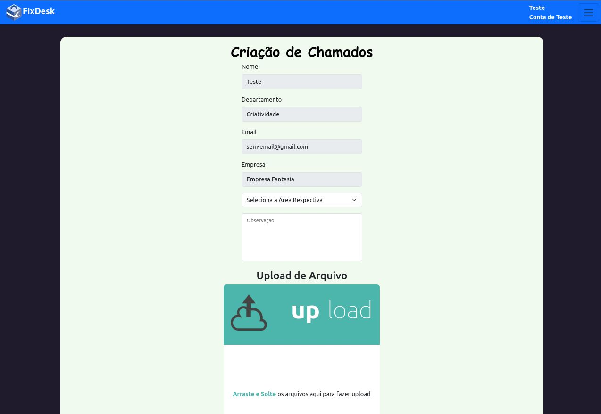

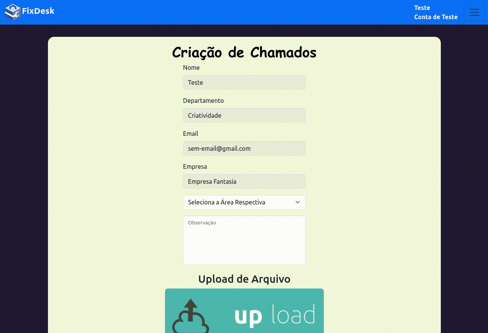

##

O Chat é atualizado quando estiver com o chamado aberto de 1 em 1 minuto.

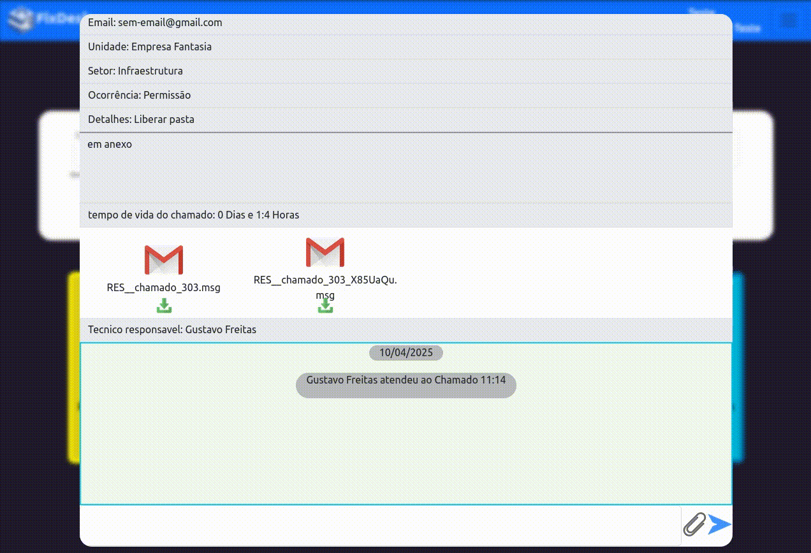

##

## ⚙️ Funcionalidades

### 🔧 Backend (Django + MySQL)

- Estrutura robusta com Django ORM e conexão otimizada ao MySQL
- Threads para envio assíncrono de e-mails de atendimento e encerramento
- Verificação automática de novos tickets e mensagens por minuto
- API RESTful para integração com o frontend em React
- Sistema de filtros extremamente robusto, permitindo personalização profunda para busca de tickets, status, e períodos específicos

### 🖥️ Frontend (React)

- Estado global com `useContext` e gerenciamento dinâmico com `useState`, `useEffect`, `useCallback` e `useRef`
- Chat em tempo real entre usuários e técnicos
- Dashboards com gráficos:
  - Chamados por status
  - Chamados por semana/mês/ano
  - Carga operacional por técnico
- Sistema de filtros flexível:
  - Filtragem por status, categoria, técnico, data de abertura, prioridade, entre outros
  - Opções avançadas de busca por múltiplos critérios e combinações de filtros

### 📊 Analytics Integrados

- Visualização completa do fluxo de suporte
- Gráficos com filtros dinâmicos e interativos
- Insights para decisão gerencial

### ✉️ Notificações Inteligentes

- Envio automático de e-mails ao abrir ou encerrar tickets
- Gestão assíncrona com threads Python

##

## 📷 Mais algumas imagens

## Dashboards

# - Dashboard Pie

Este contem 4 tipo de dados:

- Chamados em Abertos (atendidos ou não)
- Chamados Finalizados
- Chamados em aguardo (Casos que devem ficar em aguardo são alguns em especificos, caso seja feito alguma slicitação para equipe e a mesma precisa de um retorno externo e que possa demorar, sugiro que invez de finalizar, deixar em aguardo, pois serve como um lembrete de algo pendente)
- Chamados Urgentes(Quando estão abertos e não foram atendidos a pelo menos semana)

  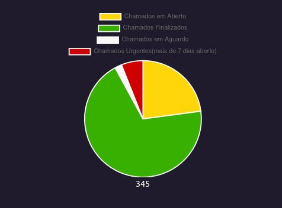

  # - Dashboard Bar

  Este mostra a quantidade de chamados abertos pelo tempo pré determinado:

  - Pela semana (Mostra dias da semana atual e sua quantidade de chamados)

    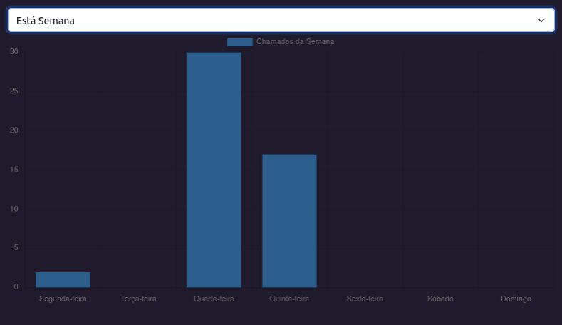

  - Pelo mês (Mostra os dias do mês atual e os chamados abertos respectivamente)

    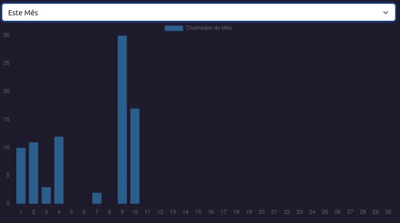

  - Pelo ano (Mostra os meses do ano atual e a quantidade de chamados respectivamente)

    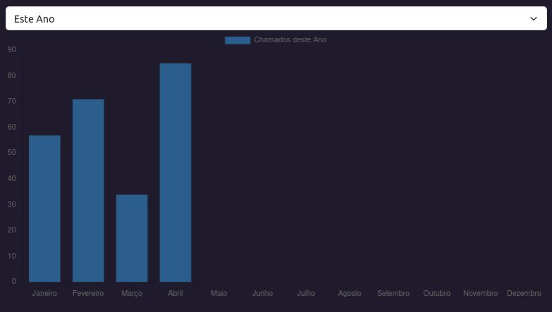

  - Total (Mostra a quantidade de chamados por todos os anos que a ferramenta esteve ativa)

    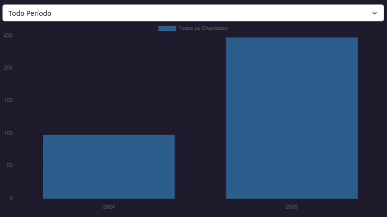

## Ferramentas do chamado

- PDF e Modificações
  Ao Abrir o chamado na parte superior esquerda tem 2 botões, um dele sendo apra baixar o chamado em formato PDF e outro para modificações, como alterar o responsável pelo atendimento e mudança de status do mesmo.

  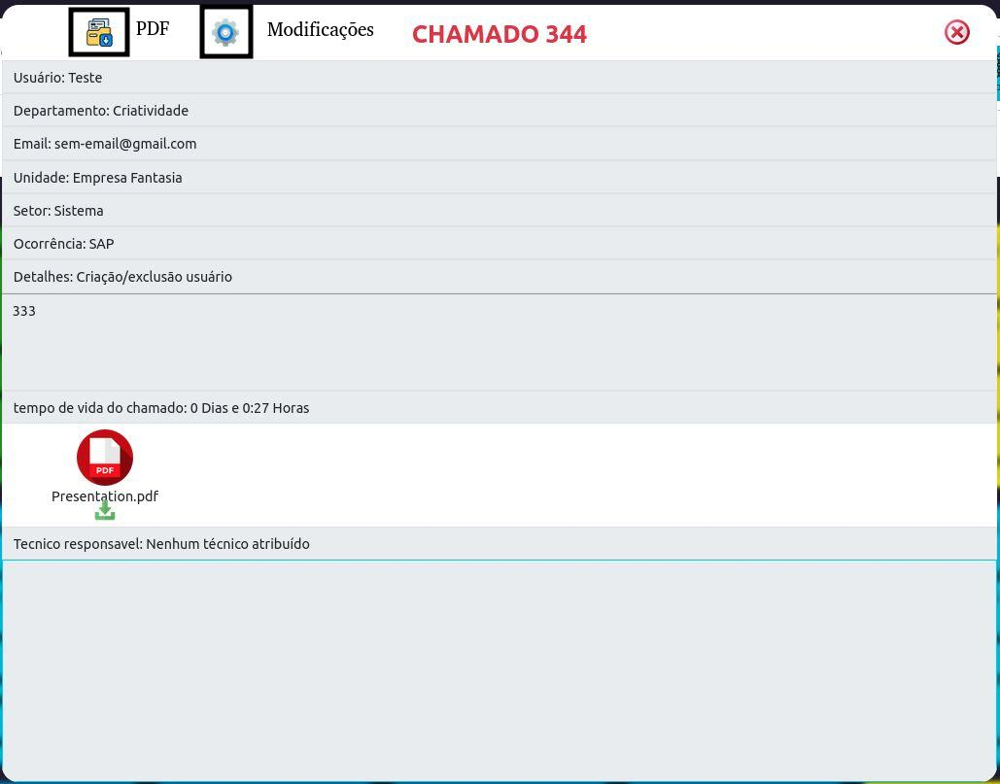

# - Impressão de PDF

O PDF mostrá as conversas tambem caso ajá alguma e quem enviou, caso aja muitas menssagens será criado novas paginas para mostrar tudo.

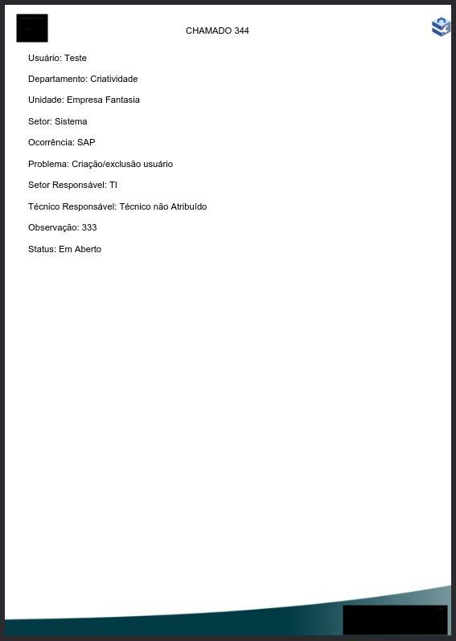

# - Transfêrencia de responsável

A lista é sempre atualizada buscando pelos membros do grupo de tecnicos pré definido no Django.

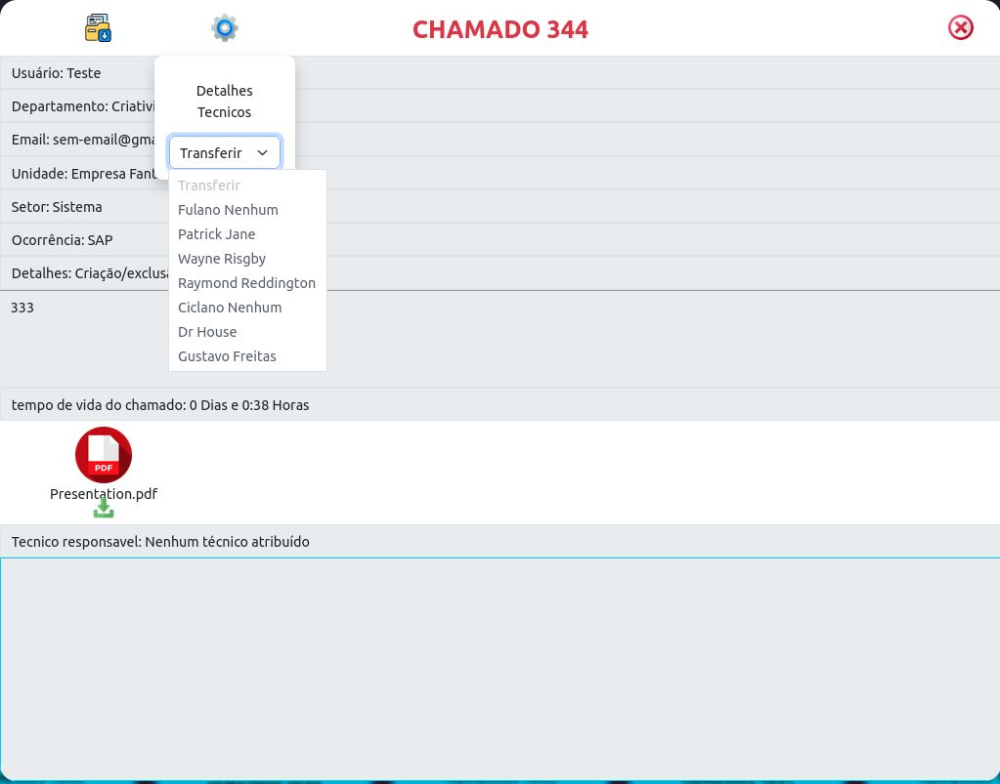

# - Mudança de status

Após o chamado ser transferido, quem tiver posse do mesmo pode realizar algumas funções adicionais, como encerar o chamado ou mesmo deixar em modo de aguardo.

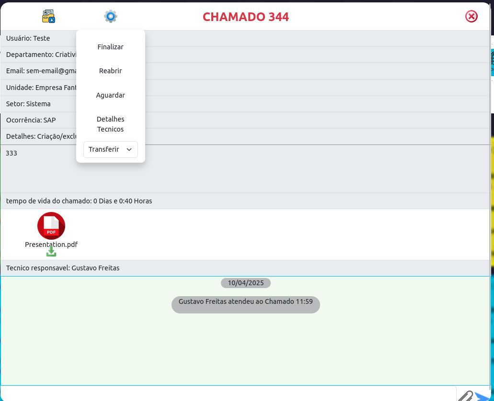

This project is licensed under the [Apache License 2.0](LICENSE).
